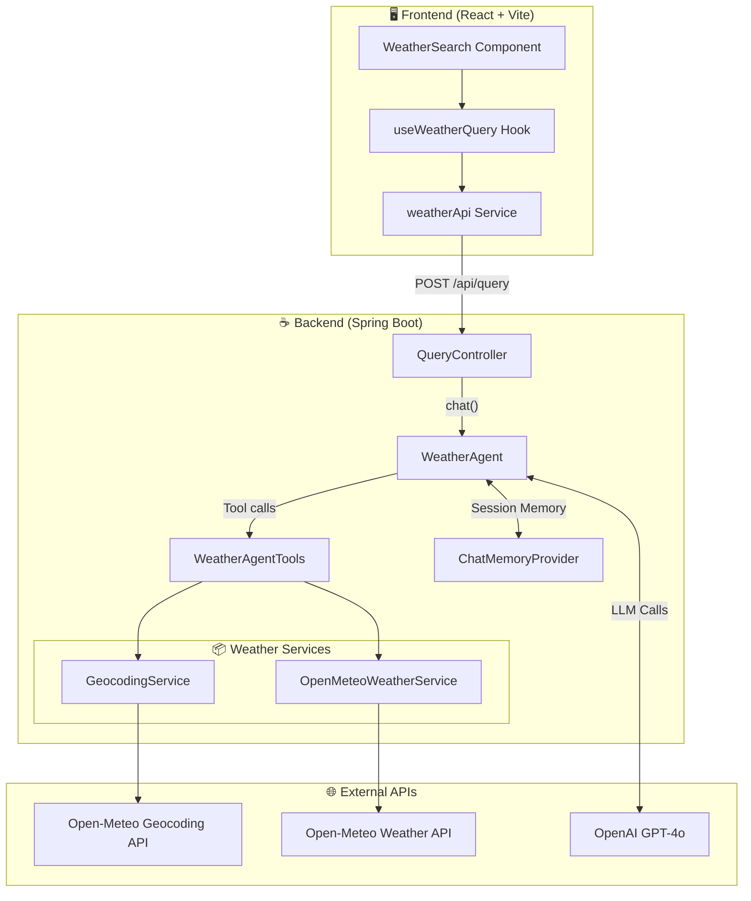
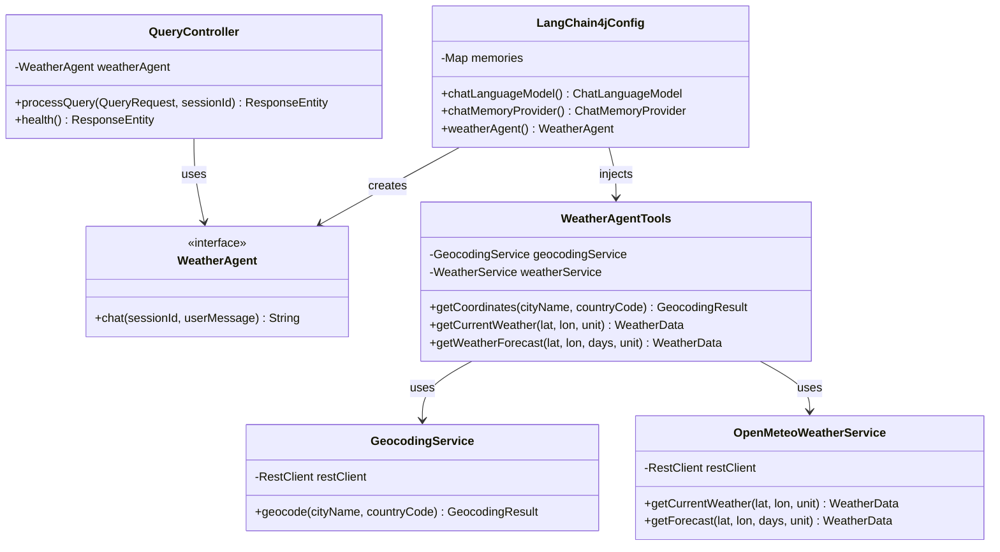
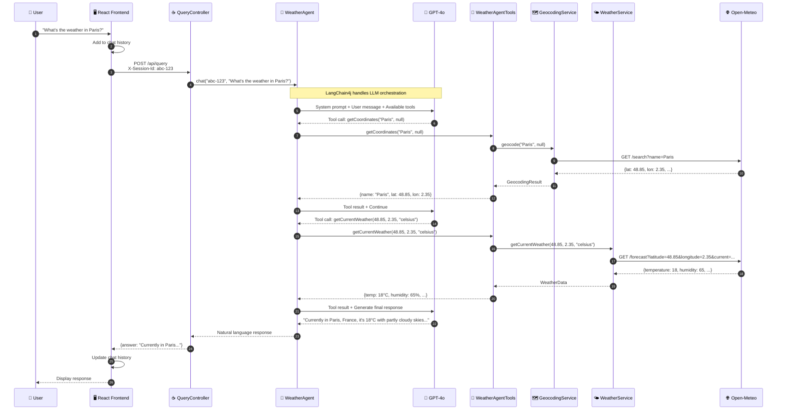
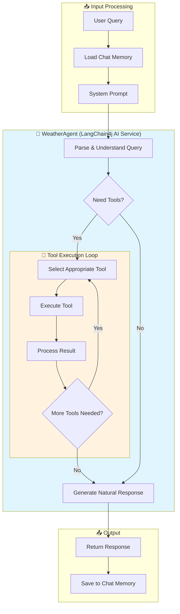
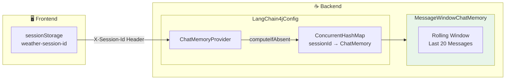
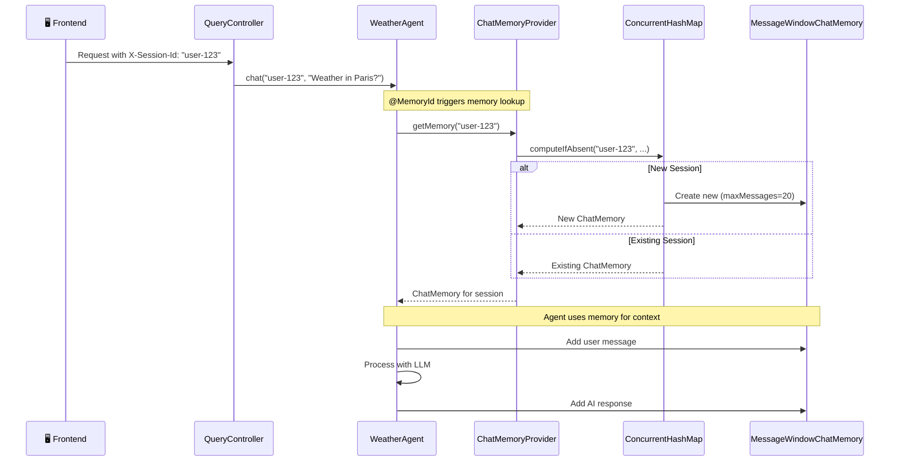
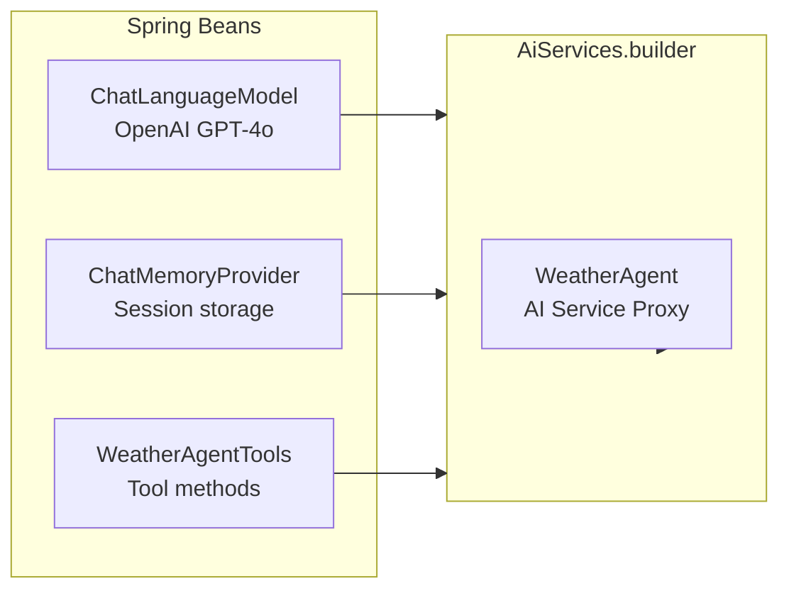
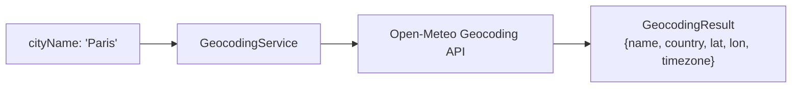
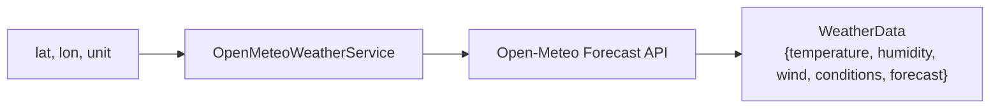
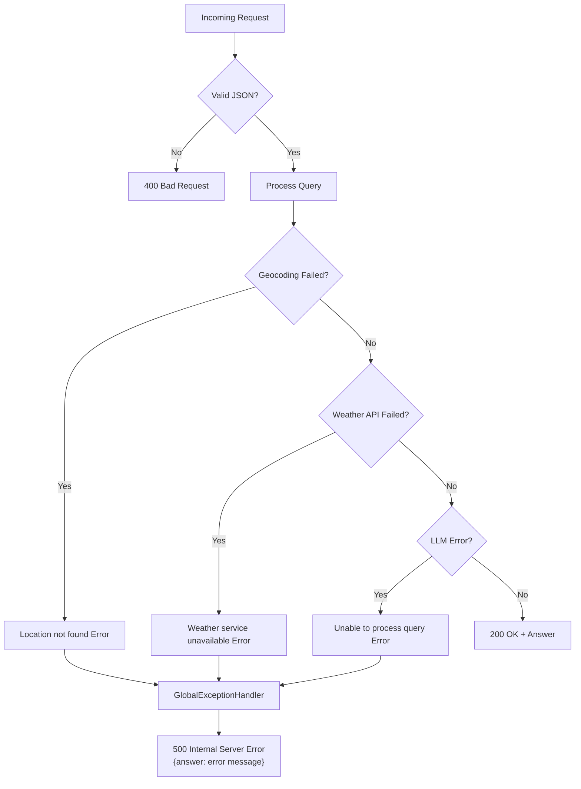

# 🌤️ Agentic Weather Search PoC

An AI-powered weather query system demonstrating **LangChain4j** integration with **Spring Boot**. Users ask natural language questions and receive human-friendly weather responses through an intelligent agent that uses tool-calling capabilities.

---

## 📋 Table of Contents

- [Architecture Overview](#-architecture-overview)
- [Tech Stack](#-tech-stack)
- [Backend Deep Dive](#-backend-deep-dive)
  - [Component Architecture](#component-architecture)
  - [Request Flow](#request-flow)
  - [LangChain4j Agent Flow](#langchain4j-agent-flow)
  - [Memory Management](#memory-management)
- [Project Structure](#-project-structure)
- [Key Components](#-key-components)
- [API Reference](#-api-reference)
- [Setup & Running](#-setup--running)
- [Sample Queries](#-sample-queries)

---

## 🏗️ Architecture Overview



---

## 🛠️ Tech Stack

| Layer | Technology | Purpose |
|-------|------------|---------|
| 🖥️ **Frontend** | React 18 + TypeScript + Vite | Modern SPA with hot reload |
| 🎨 **Styling** | Tailwind CSS | Utility-first CSS framework |
| ☕ **Backend** | Spring Boot 3.3 | REST API and dependency injection |
| 🤖 **AI Framework** | LangChain4j 1.0.0 | AI service abstraction with tools |
| 🧠 **LLM** | OpenAI GPT-4o | Natural language understanding |
| 🌤️ **Weather Data** | Open-Meteo API | Free weather and geocoding |

---

## 🔍 Backend Deep Dive

### Component Architecture



---

### Request Flow

This diagram shows the complete request lifecycle from user input to response:



---

### LangChain4j Agent Flow

The agent uses a **ReAct (Reason + Act)** pattern to process queries:



#### Available Tools

| Tool | Description | Parameters | Returns |
|------|-------------|------------|---------|
| 🗺️ `getCoordinates` | Resolves city name to lat/lon | `cityName`, `countryCode?` | `GeocodingResult` |
| 🌡️ `getCurrentWeather` | Gets current conditions | `lat`, `lon`, `unit?` | `WeatherData` |
| 📅 `getWeatherForecast` | Gets multi-day forecast | `lat`, `lon`, `days`, `unit?` | `WeatherData` |

---

### Memory Management

The system maintains **per-session conversation memory** using LangChain4j's `MessageWindowChatMemory`:



#### Memory Flow Detail



---

## 📁 Project Structure

```
full-stack-poc/
├── 📂 backend/                           # Spring Boot Application
│   └── src/main/java/com/weatheragent/
│       │
│       ├── 🚀 WeatherAgentApplication.java    # Entry point
│       │
│       ├── 📂 controller/
│       │   └── QueryController.java           # REST endpoint handler
│       │
│       ├── 📂 service/
│       │   ├── 📂 agent/
│       │   │   ├── WeatherAgent.java          # AI Service interface
│       │   │   └── WeatherAgentTools.java     # @Tool annotated methods
│       │   │
│       │   └── 📂 weather/
│       │       ├── WeatherService.java        # Interface
│       │       ├── OpenMeteoWeatherService.java
│       │       └── GeocodingService.java
│       │
│       ├── 📂 model/
│       │   ├── 📂 dto/
│       │   │   ├── QueryRequest.java
│       │   │   └── QueryResponse.java
│       │   │
│       │   └── 📂 weather/
│       │       ├── WeatherData.java
│       │       └── GeocodingResult.java
│       │
│       ├── 📂 config/
│       │   ├── LangChain4jConfig.java         # AI wiring
│       │   └── WebConfig.java                 # CORS
│       │
│       └── 📂 exception/
│           ├── WeatherApiException.java
│           └── GlobalExceptionHandler.java
│
└── 📂 frontend/                          # React Application
    └── src/
        ├── 📂 components/
        │   ├── WeatherSearch.tsx              # Main container
        │   ├── QueryInput.tsx
        │   ├── SubmitButton.tsx
        │   └── ResponseDisplay.tsx
        │
        ├── 📂 services/
        │   └── weatherApi.ts                  # API client
        │
        ├── 📂 hooks/
        │   └── useWeatherQuery.ts             # State management
        │
        └── 📂 types/
            └── index.ts
```

---

## 🔑 Key Components

### 1. QueryController
**📍 Location:** `controller/QueryController.java`

Handles HTTP requests and delegates to the AI agent.

```java
@PostMapping("/api/query")
public ResponseEntity<QueryResponse> processQuery(
        @RequestBody QueryRequest request,
        @RequestHeader("X-Session-Id") String sessionId) {

    String answer = weatherAgent.chat(sessionId, request.query());
    return ResponseEntity.ok(new QueryResponse(answer));
}
```

**Key Points:**
- Extracts session ID from header for memory isolation
- Generates UUID if no session ID provided
- Simple delegation to AI agent

---

### 2. WeatherAgent
**📍 Location:** `service/agent/WeatherAgent.java`

LangChain4j AI Service interface with system prompt.

```java
@SystemMessage("""
    You are a helpful weather assistant with memory of our conversation.
    1. Understand natural language weather queries
    2. Extract location, time frame, and data type
    3. Use tools to get weather data
    4. Provide friendly, conversational responses
    5. Remember previous queries in the conversation
    """)
String chat(@MemoryId String sessionId, @UserMessage String userMessage);
```

**Key Points:**
- `@SystemMessage` defines the agent's behavior
- `@MemoryId` enables per-session memory
- `@UserMessage` marks the user input

---

### 3. WeatherAgentTools
**📍 Location:** `service/agent/WeatherAgentTools.java`

Defines tools the LLM can call:

```java
@Tool("Resolves a city name to geographic coordinates")
public GeocodingResult getCoordinates(
    @P("City name to look up") String cityName,
    @P(value = "Optional country code", required = false) String countryCode) {
    return geocodingService.geocode(cityName, countryCode);
}
```

**Key Points:**
- `@Tool` annotation makes method available to LLM
- `@P` provides parameter descriptions for LLM
- Returns rich objects that LLM interprets

---

### 4. LangChain4jConfig
**📍 Location:** `config/LangChain4jConfig.java`

Wires together the AI components:



---

### 5. Weather Services

#### GeocodingService
**📍 Location:** `service/weather/GeocodingService.java`



#### OpenMeteoWeatherService
**📍 Location:** `service/weather/OpenMeteoWeatherService.java`



---

## 📡 API Reference

### POST /api/query

Send a natural language weather query.

**Headers:**
| Header | Required | Description |
|--------|----------|-------------|
| `Content-Type` | Yes | `application/json` |
| `X-Session-Id` | No | Session ID for conversation memory |

**Request Body:**
```json
{
  "query": "What's the weather like in Tokyo tomorrow?"
}
```

**Response:**
```json
{
  "answer": "Tomorrow in Tokyo, Japan, expect a high of 22°C and a low of 15°C with clear skies. Perfect weather for outdoor activities!"
}
```

**Example cURL:**
```bash
curl -X POST http://localhost:8080/api/query \
  -H "Content-Type: application/json" \
  -H "X-Session-Id: my-session-123" \
  -d '{"query": "Weather in Paris?"}'
```

---

### GET /api/health

Check backend health status.

**Response:**
```
Weather Agent Backend is running
```

---

## 🚀 Setup & Running

### Prerequisites

- ☕ Java 17+
- 📦 Node.js 18+
- 🔧 Maven 3.8+
- 🔑 OpenAI API Key

### Configuration

1. Copy the example configuration:
   ```bash
   cp backend/src/main/resources/application.yml.example \
      backend/src/main/resources/application.yml
   ```

2. Edit `application.yml` and add your OpenAI API key:
   ```yaml
   openai:
     api-key: sk-your-actual-api-key-here
     model: gpt-4o
   ```

### Start Backend

```bash
cd backend
mvn spring-boot:run
```
Backend runs at: `http://localhost:8080`

### Start Frontend

```bash
cd frontend
npm install
npm run dev
```
Frontend runs at: `http://localhost:5173`

---

## 💬 Sample Queries

| Query | Agent Action |
|-------|--------------|
| "What's the weather in Paris?" | `getCoordinates` → `getCurrentWeather` |
| "Will it rain in London tomorrow?" | `getCoordinates` → `getWeatherForecast(days=1)` |
| "What about next week?" | Uses memory to get last location → `getWeatherForecast(days=7)` |
| "Temperature in New York right now" | `getCoordinates` → `getCurrentWeather` |
| "Tokyo forecast in Fahrenheit" | `getCoordinates` → `getWeatherForecast(unit=fahrenheit)` |

---

## 🧪 Error Handling Flow



---

## 📜 License

MIT License - Feel free to use and modify!
